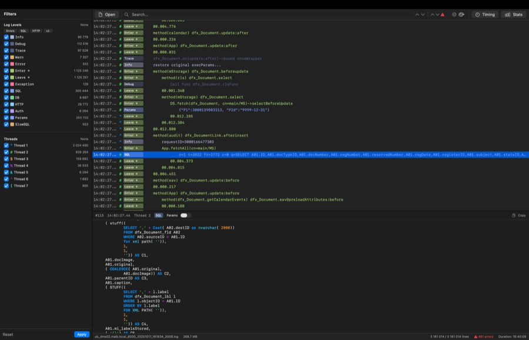

# Logram

Native cross-platform UnityBase log analyzer for **macOS** and **Windows**.

Opens multi-gigabyte UB server logs and turns them into a readable stream with filters, method timing, SQL highlighting, and cust1 parameter substitution.

**[logram.perek.rest](https://logram.perek.rest)** &middot; [Download latest release](https://github.com/qwq-qwq/Logram/releases/latest)



---

## Features

- **4 log formats** auto-detected: mORMot 1, mORMot 2 HiRes, journald, console
- **32 UB log levels** with colored badges and glyph icons in the macOS sidebar
- **Filter by level and thread** with one-click presets (Errors, SQL, HTTP, +/-)
- **Sticky focus** — the selected line stays selected and centered when filter checkboxes are toggled
- **Method timing** pairs `+` and `-` entries, sorted by duration
- **SQL highlighting** with cust1 parameter substitution
- **Tabs** native macOS window tabs (Cmd+N)
- **Themes** Tokyo Night and TTY
- **Keyboard-driven** Cmd+J (jump to pair), Cmd+C (copy), F3 (find next)
- **Drag & drop** log files into the window

## Architecture

Two independent native implementations sharing the same parser logic and feature set:

| | macOS | Windows |
|---|---|---|
| Language | Swift 5.9 | C++20 |
| UI | SwiftUI + NSTableView | Win32 + Direct2D + DirectWrite |
| Log table | NSViewRepresentable | Custom D2D control, 60fps |
| File I/O | Data(mappedIfSafe) | Memory-mapped (MapViewOfFile) |
| Line struct | LogLine (~120 bytes) | LogLineHot (20 bytes SoA) |
| Parsing | async chunks + Task.yield | std::jthread x CPU cores |
| Detail panel | SwiftUI | RichEdit + manual highlighting |
| Binary size | ~1.2 MB (.app) | ~440 KB (.exe) |

## Build

### macOS

```bash
open Logram.xcodeproj
# or
xcodebuild -scheme Logram -configuration Release build
```

Requires macOS 14+, Xcode 15+.

### Windows

```bash
cd LogramWin
cmake -B build -G "Visual Studio 17 2022" -A x64
cmake --build build --config Release
```

Requires Windows 10+, Visual Studio 2022, x64 only.

## UB Log Format

```
YYYYMMDD HHMMSSCC  T level  <TAB>message
```

- `HHMMSSCC` hours, minutes, seconds, centiseconds
- `T` thread char: `!`=0, `"`=1, `#`=2, `$`=3, ... (charCode - 0x21)
- `level` 6-char code: `info  `, `SQL   `, `EXC   `, ` +    `, ` -    `, etc.

## License

MIT